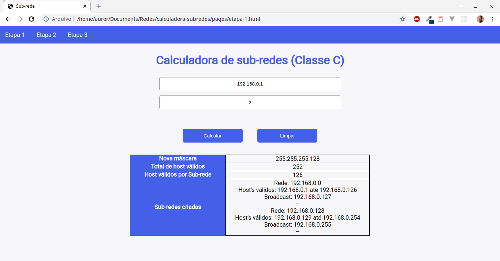
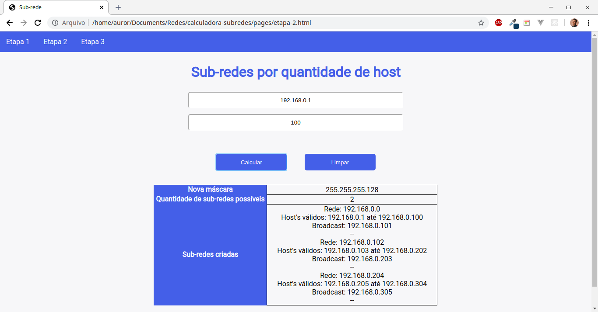
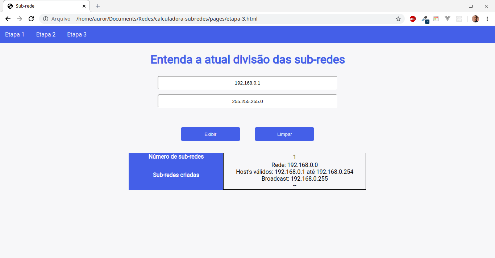
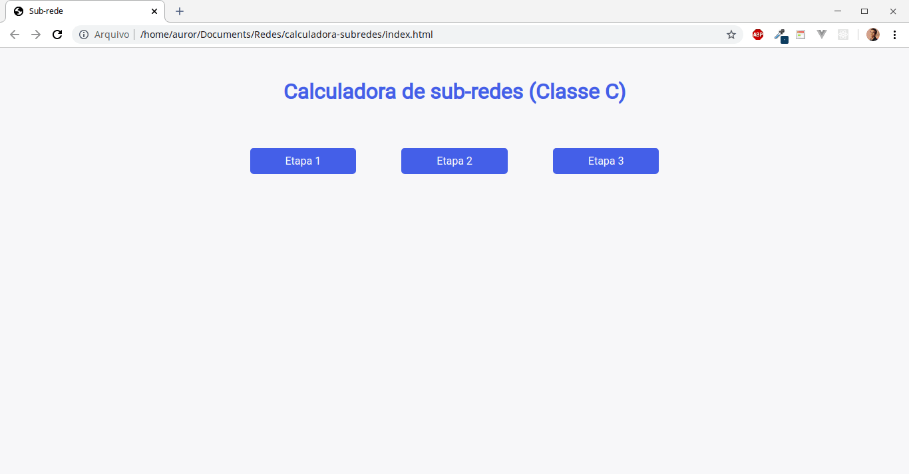

# calculadora-subredes

> Um projeto de calculadora de sub-redes utilizando Vue CDN

## :computer: Interfaces

### Etapa 1

  

### Etapa 2

  

### Etapa 3

  

## :arrow_forward: Demonstração

  

## :rocket: Tecnologias utilizadas 

O projeto foi feito utilizando as seguintes tecnologias:

- [HTML](https://www.w3schools.com/html/)
- [CSS](https://www.w3schools.com/css/)
- [VueJS](https://vuejs.org/)
{...}

## :fire: Executando a aplicação
Execute o arquivo `index.html` localizado na raiz do projeto.

## :page_facing_up: Licença 
Este projeto é desenvolvido sob a licença MIT. Veja o arquivo [LICENSE](LICENSE.md) para saber mais detalhes.

Feito com :blue_heart: por <strong> Carlos Henrique da Costa Silva </strong> 

